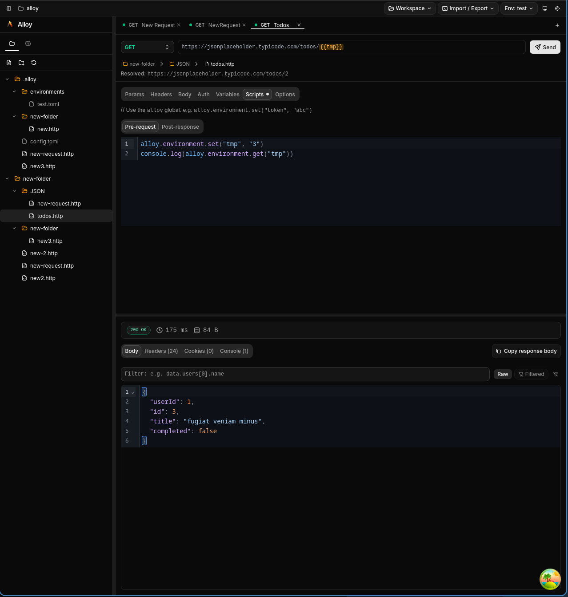

# Alloy


[](#) [](#)

Alloy is a desktop HTTP API client built with Tauri, Rust, and React. It gives you a fast native app for composing requests, managing environments, and inspecting responses without locking your data into a cloud workspace.

## Features

- Native desktop API client powered by Rust + Reqwest
- Full request builder: method, URL, query params, headers, auth, timeout, TLS options
- Multiple body modes: JSON, raw, form-urlencoded, and multipart file upload
- Response viewer with pretty JSON, headers, cookies, timing, size, and status summary
- Binary response support with image preview, hex view, and save-to-file
- Workspace-first flow with `.http` request files and file-tree collections
- Environment variables in TOML with `{{variable}}` templating
- SQLite-backed request history with search
- Multi-tab workflow and keyboard shortcuts
- cURL import/export and Postman v2.1 collection import
- Pre-request and post-response scripting hooks

## Screenshots



## Getting Started

### Prerequisites

- [Bun](https://bun.sh/)
- [Rust toolchain](https://www.rust-lang.org/tools/install)
- Tauri system dependencies for your OS: https://v2.tauri.app/start/prerequisites/

### Install

```bash
bun install
```

### Run in Development

```bash
bun tauri dev
```

For frontend-only work:

```bash
bun run dev
```

### Production Build

```bash
bun tauri build
```

## Workspace Format

Alloy stores project-level metadata in a `.alloy/` directory and requests in `.http` files.

```text
my-project/
  .alloy/
    config.toml
    environments/
      local.toml
      production.toml
  requests/
    users.http
    auth.http
```

`{{variables}}` are resolved at send time from the active environment.

## Scripting

Each request can have a **pre-request** and a **post-response** JavaScript script. Scripts run in an embedded [Boa](https://github.com/boa-dev/boa) JS engine and have access to the `alloy` global object.

### Pre-request script

Runs before the request is sent. Can read and modify the outgoing request.

```javascript
// Stamp a timestamp into an environment variable before sending
const timestamp = new Date().toISOString();
alloy.environment.set("timestamp", timestamp);

// Dynamically override the request method or URL
alloy.request.method = "POST";
alloy.request.url = "https://api.example.com/v2/users";

// Add or change a header
alloy.request.headers.add("X-Request-ID", crypto.randomUUID());
```

### Post-response script

Runs after a response is received. Can read the response and write back to the environment.

```javascript
// Extract a token from the response and persist it
const body = alloy.response.json();
alloy.environment.set("auth_token", body.token);
alloy.environment.set("last_user_id", String(body.id));

// Log timing info
alloy.console.log(`Response time: ${alloy.response.responseTime}ms`);
```

### `alloy` API reference

| Object                              | Available in  | Description                                           |
| ----------------------------------- | ------------- | ----------------------------------------------------- |
| `alloy.request.method`              | Pre-request   | HTTP method (readable/writable)                       |
| `alloy.request.url`                 | Pre-request   | Request URL (readable/writable)                       |
| `alloy.request.headers`             | Pre-request   | Headers with `.add(key, value)` / `.remove(key)`      |
| `alloy.request.queryParams`         | Pre-request   | Query params with `.add(key, value)` / `.remove(key)` |
| `alloy.request.body`                | Pre-request   | Raw request body string (readable/writable)           |
| `alloy.response.code`               | Post-response | HTTP status code (e.g. `200`)                         |
| `alloy.response.status`             | Post-response | Status text (e.g. `"OK"`)                             |
| `alloy.response.headers`            | Post-response | Response headers object                               |
| `alloy.response.text()`             | Post-response | Response body as a string                             |
| `alloy.response.json()`             | Post-response | Response body parsed as JSON                          |
| `alloy.response.responseTime`       | Post-response | Elapsed time in milliseconds                          |
| `alloy.response.responseSize`       | Post-response | Response body size in bytes                           |
| `alloy.environment.get(key)`        | Both          | Read a persisted environment variable                 |
| `alloy.environment.set(key, value)` | Both          | Write a persisted environment variable                |
| `alloy.environment.unset(key)`      | Both          | Remove a persisted environment variable               |
| `alloy.environment.has(key)`        | Both          | Check if an environment variable exists               |
| `alloy.variables.get(key)`          | Both          | Read a request-scoped variable                        |
| `alloy.variables.set(key, value)`   | Both          | Write a request-scoped variable                       |
| `alloy.info.eventName`              | Both          | `"pre-request"` or `"post-response"`                  |
| `alloy.info.requestName`            | Both          | Name of the current request                           |
| `alloy.console.log(...args)`        | Both          | Log output shown in the UI                            |

### Storage in `.http` files

Scripts are stored as comment blocks inside `.http` files, keeping them compatible with the VSCode REST Client format.

```http
### Create User
# @pre-request
# alloy.request.headers.add("X-Timestamp", new Date().toISOString());
# @end-pre-request
# @post-response
# const id = alloy.response.json().id;
# alloy.environment.set("last_user_id", String(id));
# @end-post-response
POST {{base_url}}/users HTTP/1.1
Content-Type: application/json

{"name": "Alice"}
```

## Tech Stack

- **Desktop:** Tauri v2
- **Frontend:** React 19 + TypeScript + Vite
- **Backend:** Rust + Reqwest
- **IPC:** TauRPC + Specta type export
- **State:** Zustand
- **Editor:** CodeMirror 6
- **Styling/UI:** Tailwind CSS 4 + shadcn/Radix
- **Persistence:** rusqlite (SQLite)
- **Templating:** Handlebars
- **Scripting:** Boa JavaScript engine

## Contributing

Contributions are welcome. If you are new to the codebase, start here:

- `src/` for React UI, state stores, and request/response components
- `src-tauri/src/` for Rust services and TauRPC command handlers
- `src/lib/api.ts` for frontend API proxy wiring
- `src/bindings.ts` is generated by TauRPC at runtime (do not hand-edit)

Useful commands:

```bash
# Frontend checks/build
bun run typecheck
bun run build

# Full app development
bun tauri dev

# Rust checks/tests
cargo check --manifest-path src-tauri/Cargo.toml
cargo test --manifest-path src-tauri/Cargo.toml
```

## License

MIT
