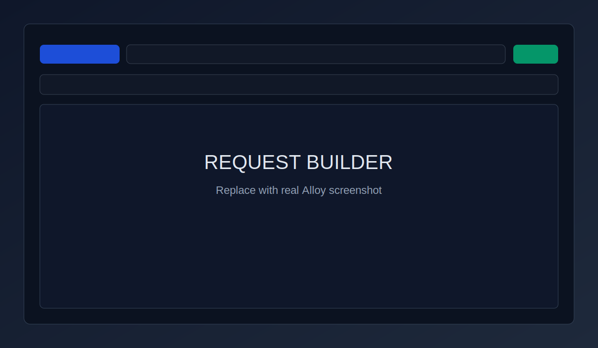
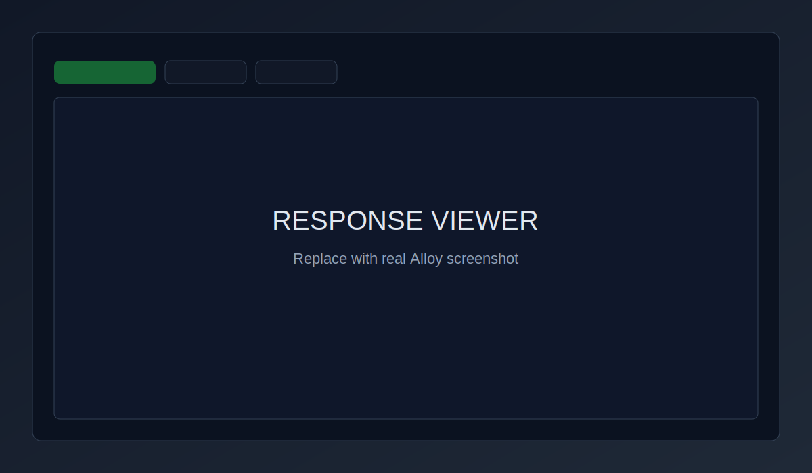
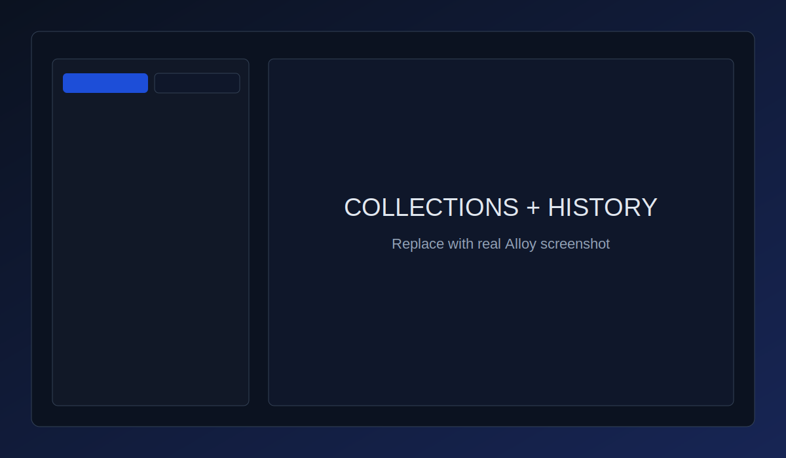

# Alloy

[](#) [](#)

Alloy is a desktop HTTP API client built with Tauri, Rust, and React. It gives you a fast native app for composing requests, managing environments, and inspecting responses without locking your data into a cloud workspace.

## Features

- Native desktop API client powered by Rust + Reqwest
- Full request builder: method, URL, query params, headers, auth, timeout, TLS options
- Multiple body modes: JSON, raw, form-urlencoded, and multipart file upload
- Response viewer with pretty JSON, headers, cookies, timing, size, and status summary
- Binary response support with image preview, hex view, and save-to-file
- Workspace-first flow with `.http` request files and file-tree collections
- Environment variables in TOML with `{{variable}}` templating
- SQLite-backed request history with search
- Multi-tab workflow and keyboard shortcuts
- cURL import/export and Postman v2.1 collection import
- Pre-request and post-response scripting hooks

## Screenshots

Replace these placeholders with real screenshots as the UI evolves.


*Request builder: method selector, URL bar, tabs, and send flow.*


*Response panel: body, headers, cookies, status, timing, and size.*


*Sidebar with collections and request history.*

## Getting Started

### Prerequisites

- [Bun](https://bun.sh/)
- [Rust toolchain](https://www.rust-lang.org/tools/install)
- Tauri system dependencies for your OS: https://v2.tauri.app/start/prerequisites/

### Install

```bash
bun install
```

### Run in Development

```bash
bun tauri dev
```

For frontend-only work:

```bash
bun run dev
```

### Production Build

```bash
bun tauri build
```

## Workspace Format

Alloy stores project-level metadata in a `.alloy/` directory and requests in `.http` files.

```text
my-project/
  .alloy/
    config.toml
    environments/
      local.toml
      production.toml
  requests/
    users.http
    auth.http
```

`{{variables}}` are resolved at send time from the active environment.

## Tech Stack

- **Desktop:** Tauri v2
- **Frontend:** React 19 + TypeScript + Vite
- **Backend:** Rust + Reqwest
- **IPC:** TauRPC + Specta type export
- **State:** Zustand
- **Editor:** CodeMirror 6
- **Styling/UI:** Tailwind CSS 4 + shadcn/Radix
- **Persistence:** rusqlite (SQLite)
- **Templating:** Handlebars
- **Scripting:** Boa JavaScript engine

## Contributing

Contributions are welcome. If you are new to the codebase, start here:

- `src/` for React UI, state stores, and request/response components
- `src-tauri/src/` for Rust services and TauRPC command handlers
- `src/lib/api.ts` for frontend API proxy wiring
- `src/bindings.ts` is generated by TauRPC at runtime (do not hand-edit)

Useful commands:

```bash
# Frontend checks/build
bun run typecheck
bun run build

# Full app development
bun tauri dev

# Rust checks/tests
cargo check --manifest-path src-tauri/Cargo.toml
cargo test --manifest-path src-tauri/Cargo.toml
```

## License

MIT
